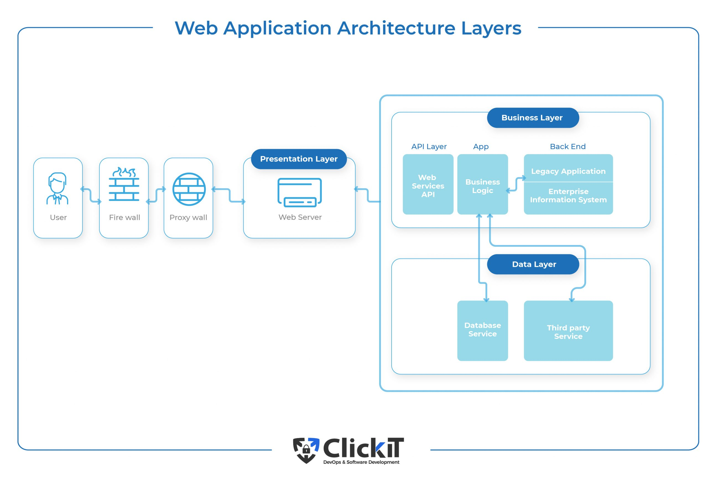
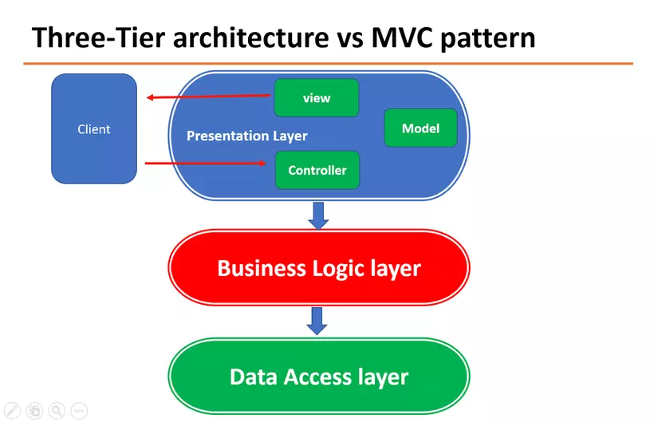

# Web architecture
> ["Link post"](https://www.indeed.com/career-advice/finding-a-job/what-is-web-architecture)

#### 3 tier layer

> ["Việt Hóa hơn"](https://topdev.vn/blog/mo-hinh-3-lop-la-gi/)

- Presentation Tier : 
> - Hiển thị giao diện
> - Tiếp nhận thông tin, báo lỗi ...
--- MVC ở đây ---

- Bussiness Logic Tier : 
> - Xử lí tính hợp lí của thông tin, 
> - Tính toán đánh giá thông tin

- Data Access Layer : 
> - Lưu CSDL
> - Cho phép Bussiness Tier thực hiện truy vấn data

VD : khi đăng nhập 1 web như Shoppee
- Giao diện ở Presentation có giao diện riêng.
(Controller nhận dũ liệu (username, password) từ view, bắn về BL)
- Từ lúc nhấp "Đăng nhập", data sẽ gửi về Bussiness để check (truy vấn vào DA). Lúc này mới phát huy tác dụng BL : 
> + Check việc 1 : user pass đó có trong CSDL ko.

`Nếu ko, --> user/pass sai --> trả về PT trang login + message sai pass`

`Nếu có thì làm dòng dưới`

> + Check việc 2 : user đó có role là ? (ngừoi bán, ngưuòi mua, ...) --> lại truy vấn vào CSDL

`Nếu role mua --> trả về PT trang home`

`Role bán --> BL sẽ trả về trang redirect cho ngừoi bán thao tác riêng`

__Suốt quá trình trên, BL phải luôn check cho dữ liệu toàn vẹn, tránh lưu dữ liệu lỗi vào CSDL__

